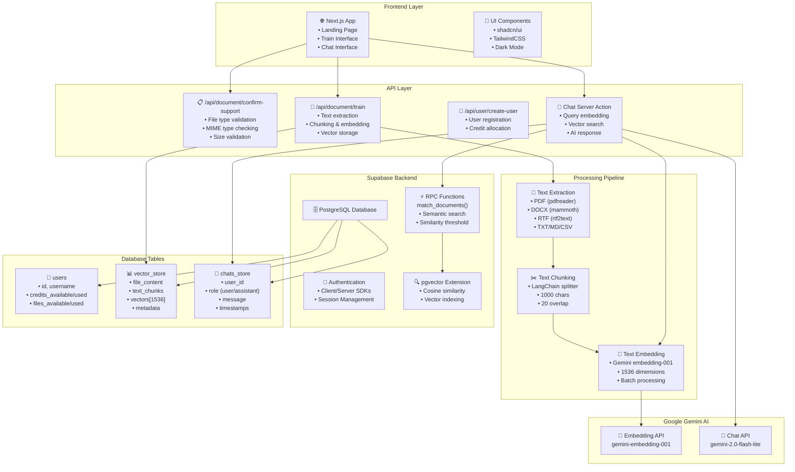

# 🤖 DocoChat AI — Intelligent Document Conversations

<div align="center">

[](https://nextjs.org/)
[](https://www.typescriptlang.org/)
[](https://supabase.com/)
[](https://ai.google.dev/)
[](https://tailwindcss.com/)

**Transform your documents into intelligent conversation partners**

*Upload • Train • Chat • Discover*

[🚀 Live Demo](#) • [📖 Documentation](#getting-started) • [🏗️ Architecture](#system-architecture) • [🔧 Setup](#installation)

</div>

---

## 🌟 What Makes DocoChat AI Special

DocoChat AI revolutionizes document interaction by combining cutting-edge **Retrieval-Augmented Generation (RAG)** with an intuitive, modern interface. Built for developers, researchers, and professionals who need to extract insights from their documents instantly.

### ✨ Key Highlights

- 🎯 **Zero Learning Curve** — Upload, train, and start chatting in seconds
- 🧠 **Advanced RAG Pipeline** — Semantic search with pgvector and Google Gemini embeddings
- 🏗️ **Production-Ready Architecture** — Type-safe, error-handled, and scalable
- 🎨 **Beautiful UX** — Modern glassmorphism design with thoughtful animations
- ⚡ **Lightning Fast** — Optimized vector search with intelligent chunking
- 🔒 **Privacy-First** — Your documents stay secure in your Supabase instance

---

## 🚀 Features

### 📄 Document Support
- **PDF** — Full text extraction with pdfreader
- **DOCX** — Microsoft Word documents via mammoth
- **TXT & MD** — Plain text and Markdown files
- **RTF** — Rich Text Format documents
- **CSV** — Structured data files *(coming soon)*

### 🤖 AI-Powered Intelligence
- **Semantic Search** — Find relevant content using meaning, not just keywords
- **Contextual Responses** — AI understands your document's context
- **Conversation Memory** — Maintains chat history for coherent discussions
- **Multi-Document Training** — Train multiple files for comprehensive knowledge

### 🎨 User Experience
- **Responsive Design** — Perfect on desktop, tablet, and mobile
- **Dark/Light Mode** — Automatic theme switching
- **Real-time Feedback** — Live upload progress and training status
- **Credit System** — Built-in usage tracking and quota management

---

## 🏗️ System Architecture

<div align="center">

### Data Flow Pipeline



</div>

### 🔄 Core Workflow

1. **📤 Document Upload** → File validation and type checking
2. **🔍 Text Extraction** → Format-specific parsing and content extraction
3. **✂️ Intelligent Chunking** → Semantic text splitting with overlap
4. **🧠 Vector Embedding** → 1536-dimensional embeddings via Gemini
5. **💾 Vector Storage** → Efficient storage in Supabase pgvector
6. **💬 Query Processing** → Semantic search and contextual response generation

### 🏛️ Technical Architecture

```typescript
// Modern Tech Stack
Frontend: Next.js 15 + React 19 + TypeScript
Styling: TailwindCSS 4 + shadcn/ui + Radix primitives  
Backend: Next.js API Routes + Server Actions
Database: Supabase (PostgreSQL + pgvector)
AI: Google Gemini (embedding-001 + 2.0-flash-lite)
Processing: LangChain text splitters + custom pipelines
```

---

## 🛠️ Installation

### Prerequisites

- **Node.js** 18+ with pnpm
- **Supabase** project with pgvector enabled
- **Google Gemini** API key

### Quick Start

```bash
# Clone the repository
git clone https://github.com/yourusername/docochat-ai.git
cd docochat-ai

# Install dependencies
pnpm install

# Set up environment variables
cp .env.example .env.local
# Edit .env.local with your credentials

# Run database migrations
# Apply the SQL files in supabase/migrations/ to your Supabase project

# Start development server
pnpm dev
```

### Environment Configuration

Create `.env.local` in the project root:

```bash
# Supabase Configuration
NEXT_PUBLIC_SUPABASE_URL=your_supabase_project_url
NEXT_PUBLIC_SUPABASE_ANON_KEY=your_supabase_anon_key

# Google Gemini API
GEMINI_API_KEY=your_google_gemini_api_key

# Optional: Custom API URL for production
NEXT_PUBLIC_API_URL=http://localhost:3000
```

### Database Setup

Execute these migrations in your Supabase SQL editor:

1. **Vector Store** — `supabase/migrations/20250712080659_create_vector_store_table.sql`
2. **Users Table** — `supabase/migrations/20250712081303_create_user_table.sql`  
3. **Chat Store** — `supabase/migrations/20250714113121_create_chats_store.sql`

Ensure **pgvector** extension is enabled in your Supabase project.

---

## 📚 API Reference

### Document Training Pipeline

#### `POST /api/document/confirm-support`
Validates file type and size before processing.

```typescript
// Request (multipart/form-data)
{
  file: File
}

// Response
{
  "success": true,
  "message": "File is supported"
}
```

#### `POST /api/document/train`
Complete document training pipeline.

```typescript
// Request (multipart/form-data)
{
  file: File,
  userDetails: JSON<UserDetails>
}

// Response
{
  "message": "File trained successfully"
}
```

### Chat Interface

#### Server Action: `sendMessage`
Processes user queries with RAG pipeline.

```typescript
// Flow
1. Validate input with Zod schema
2. Generate query embedding (Gemini)
3. Perform vector similarity search (Supabase RPC)
4. Generate contextual response (Gemini Chat)
5. Persist conversation history
```

### User Management

#### `POST /api/user/create-user`
Creates new user with default credits.

```typescript
// Request
{
  "id": "uuid",
  "username": "string",
  "credits_available": 100,
  "files_available": 1
}
```

---

## 🗂️ Project Structure

```
src/
├── app/                    # Next.js App Router
│   ├── api/               # API endpoints
│   │   ├── document/      # Document processing
│   │   └── user/          # User management
│   ├── chat/              # Chat interface
│   ├── train/             # Document upload
│   └── layout.tsx         # Root layout
├── components/            # Reusable components
│   ├── features/          # Feature-specific components
│   │   ├── chat/          # Chat UI components
│   │   ├── train/         # Training UI components
│   │   └── home/          # Landing page components
│   └── ui/                # shadcn/ui components
├── lib/                   # Core business logic
│   ├── actions/           # Server actions
│   ├── api-services/      # Service layer
│   │   └── train/         # Training pipeline
│   │       ├── text-extraction-services.ts
│   │       ├── text-chunking-services.ts
│   │       ├── text-embedding-services.ts
│   │       └── text-upsert-to-db.ts
│   └── utils.ts           # Utility functions
├── types/                 # TypeScript definitions
└── supabase/              # Database & auth
    ├── migrations/        # SQL migrations
    ├── client.ts          # Client configuration
    └── server.ts          # Server configuration
```

---

## 🔧 Development Guide

### Code Quality Standards

- **TypeScript** — Strict type checking enabled
- **ESLint** — Configured with Next.js best practices
- **Error Handling** — Comprehensive error boundaries and validation
- **Performance** — Optimized with React 19 features and Next.js 15

### Key Design Patterns

- **Server Actions** — Type-safe form handling and data mutations
- **Service Layer** — Modular business logic separation
- **Error-First Design** — Robust error handling throughout the pipeline
- **Progressive Enhancement** — Works without JavaScript, enhanced with it

### Testing Strategy

```bash
# Run linting
pnpm lint

# Type checking
pnpm type-check

# Build verification
pnpm build
```

---

## 🚀 Deployment

### Environment Variables for Production

```bash
NEXT_PUBLIC_SUPABASE_URL=your_production_supabase_url
NEXT_PUBLIC_SUPABASE_ANON_KEY=your_production_anon_key
GEMINI_API_KEY=your_gemini_api_key
NEXT_PUBLIC_API_URL=https://your-domain.vercel.app
```

---

## 🎯 Performance & Optimization

### Vector Search Optimization
- **Efficient Indexing** — Optimized pgvector indexes for sub-second search
- **Batch Processing** — Parallel embedding generation for faster training
- **Smart Chunking** — Optimal chunk size (1000 chars) with 20-char overlap

### UI/UX Optimizations
- **Server Components** — Reduced client-side JavaScript
- **Streaming** — Progressive loading with React Suspense
- **Caching** — Strategic caching of embeddings and responses

### Scalability Features
- **Horizontal Scaling** — Stateless architecture for easy scaling
- **Database Optimization** — Proper indexing and query optimization
- **Rate Limiting** — Built-in credit system for usage control

---

## 🔒 Security & Privacy

### Data Protection
- **Environment Variables** — Secure API key management
- **Input Validation** — Comprehensive file type and content validation
- **SQL Injection Prevention** — Parameterized queries and ORM usage

### File Security
- **MIME Type Verification** — Content-based file type detection
- **Size Limits** — Configurable file size restrictions
- **Secure Processing** — No file storage on server, stream processing

---

## 🎨 UI/UX Features

### Design System
- **Glassmorphism** — Modern blur effects and transparency
- **Micro-interactions** — Smooth animations and transitions
- **Accessibility** — ARIA labels and keyboard navigation
- **Responsive Design** — Mobile-first approach

### Theme Support
- **Dark/Light Mode** — Automatic system theme detection
- **Custom Gradients** — Beautiful background animations
- **Typography** — Optimized font loading with Geist fonts

---

## 🗺️ Roadmap

### 🧪 Technical Improvements

- [ ] **Unit Testing** — Comprehensive test coverage
- [ ] **E2E Testing** — Automated workflow validation
- [ ] **Performance Monitoring** — Real-time performance tracking
- [ ] **Caching Layer** — Redis integration for faster responses

---

## 🤝 Contributing

We welcome contributions! Please follow these guidelines:

1. **Fork** the repository
2. **Create** a feature branch (`git checkout -b feature/amazing-feature`)
3. **Commit** your changes (`git commit -m 'Add amazing feature'`)
4. **Push** to the branch (`git push origin feature/amazing-feature`)
5. **Open** a Pull Request

### Development Setup

```bash
# Install dependencies
pnpm install

# Set up pre-commit hooks
pnpm husky install

# Run development server
pnpm dev
```

---

## 📄 License

This project is licensed under the **MIT License** - see the [LICENSE](LICENSE) file for details.

---

## 🙏 Acknowledgments

- **Google Gemini** — Powering our AI capabilities
- **Supabase** — Providing robust backend infrastructure
- **shadcn/ui** — Beautiful, accessible UI components
- **LangChain** — Text processing and chunking utilities

---

<div align="center">

### 🌟 Star this project if you find it useful!

**Made with ❤️ by [Hemant Sharma](https://github.com/hemants1703)**

[⬆ Back to Top](#-dochat-ai--intelligent-document-conversations)

</div>